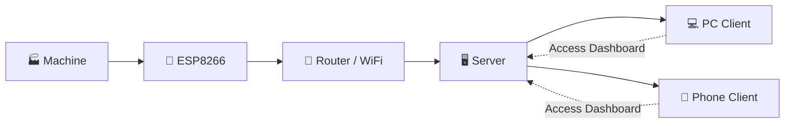

# 📊 SystemaCounter


> **SystemaCounter** is an IoT-based daily reporting system designed for manufacturing environments.  
> It collects production counter data using **ESP8266 devices**, transmits the data through a **WiFi network**, and provides monitoring dashboards accessible via **PC or mobile devices**.

The system helps factories monitor production output, track machine activity, and generate daily reports automatically.

---

# 🚀 Features

📡 **IoT Data Collection**  
Capture production counter signals directly from machines using ESP8266.

📊 **Daily Production Reporting**  
Automatically generate reports for production monitoring.

📈 **Real-Time Monitoring**  
View machine activity and production data instantly.

📱 **Multi-Device Access**  
Access dashboards from **phone, tablet, or PC**.

🧾 **Historical Data Storage**  
Keep historical production records for analysis.

⚡ **Lightweight IoT Communication**  
Optimized for low-power microcontrollers like ESP8266.

---

# 🏭 System Architecture



### Architecture Flow

```
Machine
   │
   ▼
ESP8266
   │
   ▼
Router / WiFi
   │
   ▼
Server
  │   │
  │   └────────────► PC Client
  │
  └────────────► Phone Client
```

### Data Flow Explanation

1. **Machine** generates production output signals.
2. **ESP8266** reads the counter signal from the machine.
3. The ESP8266 sends data through **WiFi to the router**.
4. The **server receives and processes the data** via API.
5. Data is stored in the **database**.
6. Users access dashboards through **PC or mobile clients**.

---

# 📡 Hardware Components

| Component        | Description                                 |
| ---------------- | ------------------------------------------- |
| 🏭 Machine       | Production machine generating count signals |
| 📡 ESP8266       | IoT microcontroller for reading counters    |
| 📶 WiFi Router   | Network communication                       |
| 🖥 Server        | Backend system & API                        |
| 📱 Client Device | PC or mobile dashboard                      |

---

# 🛠 Tech Stack

| Layer         | Technology              |
| ------------- | ----------------------- |
| IoT Device    | ESP8266                 |
| Communication | WiFi / HTTP API         |
| Backend       | Web server              |
| Database      | Production data storage |
| Frontend      | Web dashboard           |

_(Adjust according to your actual implementation)_

---

## 📥 Download

- **SystemaCounter App (Beta version / Latest)**  
     <br>
  ➡️ [Release Page](https://github.com/viwaretech/SystemaCounter/releases/latest)  
   ➡️ [Download](https://github.com/viwaretech/SystemaCounter/releases/latest/download/SystemaCounter.rar)

---

# 📝 License

This project is licensed under the **GNU General Public License v3**.

---

# 👨‍💻 Author

**HARLEY AD**  
Industrial IoT Monitoring & Smart Manufacturing

---

# ⭐ Support

If you find this project useful:

⭐ Star the repository  
🐛 Report issues  
💡 Suggest improvements
